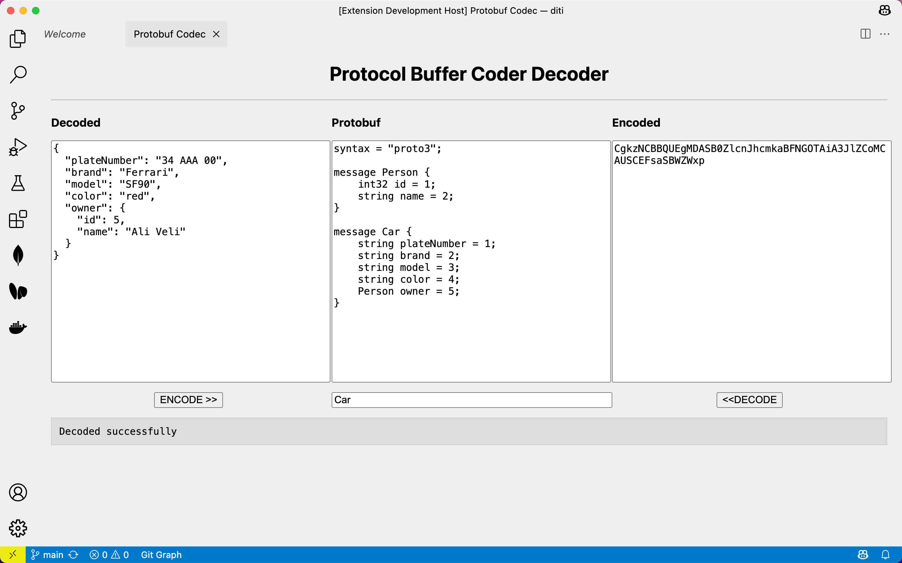

# Protocol Buffer Coder Decoder for vscode

This is a simple protocol buffer coder decoder for vscode. It can be used to encode and decode protocol buffer messages between JSON and bytes.



## Usage

**ENCODING**
1. Copy the `.proto` content to the protocol buffer text area.
1. Write the message type to encode in the input area below proto section.
1. Create a new message within JSON format inside `Decoded` text area.
1. Click the `Encode` button to encode the JSON message to bytes.
1. See the encoded bytes in the `Encoded` text area.

**DECODING**
1. Copy the `.proto` content to the protocol buffer text area.
1. Write the message type to decode in the input area below proto section.
1. Paste the encoded bytes in the `Encoded` text area.
1. Click the `Decode` button to decode the bytes to JSON.
1. See the decoded JSON message in the `Decoded` text area.

## Example

```proto
syntax = "proto3";

message Person {
    int32 id = 1;
    string name = 2;
}

message Car {
    string plateNumber = 1;
    string brand = 2;
    string model = 3;
    string color = 4;
    Person owner = 5;
}
```

```json
{
  "plateNumber": "1234",
  "brand": "Toyota",
  "model": "Corolla",
  "color": "Red",
  "owner": {
    "id": 1,
    "name": "John Doe"
  }
}
```


-----

Contact the developer <br/>
👉[mujdecisy.github.io](https://mujdecisy.github.io)👈